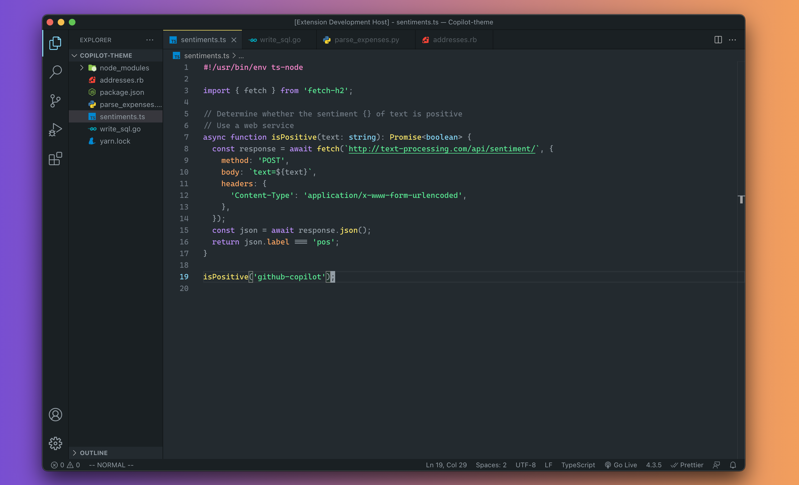
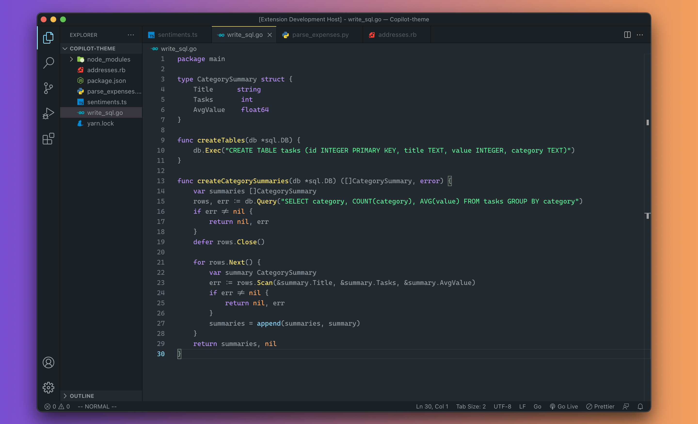
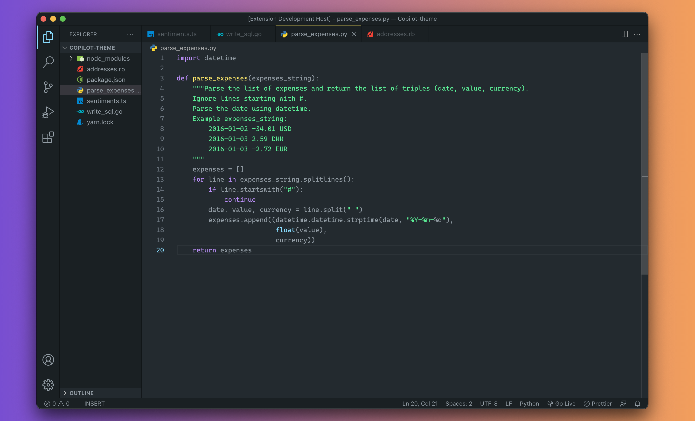
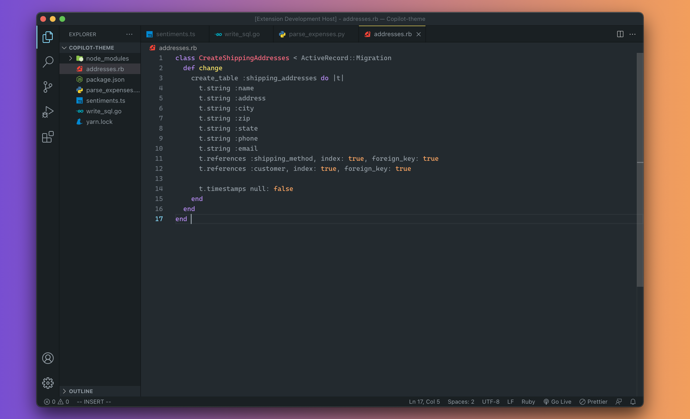

# Github Copilot theme

A VSCode implementation of the theme displayed on [Github Copilot website](https://copilot.github.com/).

### Notes:

This theme is still in progress. Feel free to open a pull request if you notice something wrong or would like to make a change.

Font used: [Cascadia Code](https://github.com/microsoft/cascadia-code)

 

### Screenshots:

Typescript

Go

Python

Ruby

 

_Code snippets in the examples are directly taken from [Github Copilot website](https://copilot.github.com/)_.
